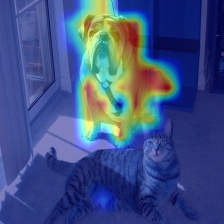

```markdown
# Grad-CAM Implementation

This repository contains code for implementing Grad-CAM (Gradient-weighted Class Activation Mapping) in PyTorch. Grad-CAM is a technique for visualizing the regions of an image that are important for predicting a particular class. It works by leveraging the gradients of a target class with respect to the ViT Norm layer.

## Requirements
- Python 3.x
- PyTorch
- Torchvision
- Timm
- NumPy
- OpenCV
- Scikit-image

## Installation
1. Clone this repository:
   ```bash
   git clone https://github.com/your_username/grad-cam.git
   cd grad-cam
   ```

## Usage
1. Ensure that your image is named `both.png` and placed in the root directory of the repository.

2. Run the `main.py` script:
   ```bash
   python main.py
   ```

3. The resulting heatmap with Grad-CAM overlay will be saved as `result.jpg` in the same directory.

## Files
- `main.py`: Python script to generate Grad-CAM visualization for a given image using a pre-trained Vision Transformer model (`vit_base_patch16_224`).
- `gradcam.py`: Python module containing the `GradCam` class, which implements the Grad-CAM algorithm.
- `both.png`: Sample input image (replace with your own image).
- `result.jpg`: Output Grad-CAM visualization.

## Input and Output
| Input Image | Output Image |
|-------------|--------------|
|  |  |

## References
- Ramprasaath R. Selvaraju, Michael Cogswell, Abhishek Das, Ramakrishna Vedantam, Devi Parikh, and Dhruv Batra. "Grad-CAM: Visual Explanations from Deep Networks via Gradient-based Localization." In *Proceedings of the IEEE International Conference on Computer Vision (ICCV)*, 2017.

## License
This project is licensed under the MIT License - see the [LICENSE](LICENSE) file for details.
```
Feel free to adjust any parts as needed!